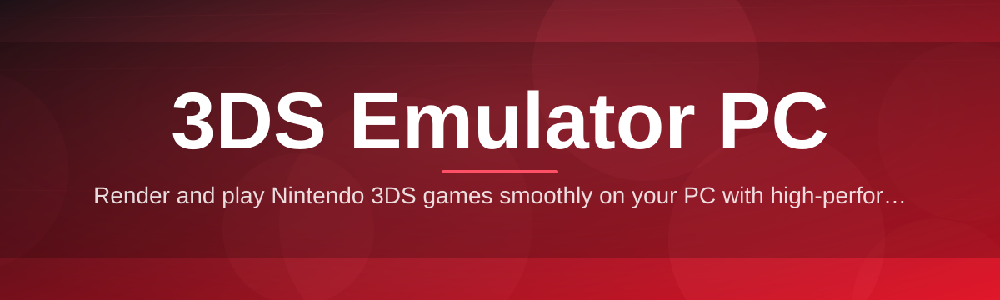
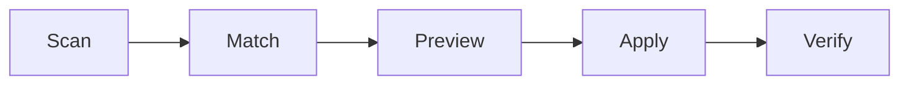

# 3ds-emulator-optimizer 🎮⚡

  

*A tuning layer for your 3DS emulator PC setup — squeeze out stable frame pacing without touching a config file by hand.*

  

<strong>The origin story — click to expand</strong>

 

This project started as a personal spreadsheet. A small group of contributors were tired of copy-pasting the same INI tweaks between emulator versions every time a new build dropped, only to watch shader caches invalidate and stutter creep back in. What began as a shared gist of "known good" settings for common 3DS emulator PC configurations slowly grew into a proper utility — one that reads your hardware, cross-references a community-maintained profile database, and applies sane defaults automatically. Three years and a few hundred pull requests later, it looks like this.

---

## 🔭 Overview

**3ds-emulator-optimizer** is a standalone Windows utility that sits alongside your existing 3DS emulator installation and takes over the tedious parts of configuration tuning. Instead of manually digging through render backend options, resolution scaling multipliers, and audio buffer settings, you point the tool at your emulator directory once, and it profiles your CPU, GPU, and storage to recommend — and optionally apply — a configuration tailored to your machine. It does not replace your emulator core; it reads and writes configuration surfaces that the emulator already exposes, then gets out of the way.

The project exists because "just increase internal resolution" is bad advice for half the machines running these emulators. A laptop with an integrated GPU and a desktop with a dedicated card need fundamentally different tradeoffs between upscaling, frame limiting, and shader compilation strategy. Rather than pretending one settings file fits everyone, this tool treats optimization as a per-machine negotiation between accuracy, performance, and battery life (on portables). It's built for people running a 3DS emulator PC setup who want it to just feel right — stable 60fps in handheld-style titles, no audio popping, no shader-compile hitching on first boot of a game.

Who this is for: hobbyists maintaining a personal game library, streamers who need consistent frame pacing on camera, and anyone who has ever opened a `.ini` file, felt a small wave of dread, and closed it again. It is not a game loader, a ROM manager, or a network service — it is a configuration and diagnostics layer, full stop.

> [!NOTE]
> The tool ships as a single portable executable. Nothing is written outside your chosen emulator folder unless you explicitly enable the backup step.

---

## 🧩 What It Actually Does

Each capability below targets a specific, recurring pain point reported by the community running 3DS emulator PC builds across a wide range of hardware.

- **Hardware-aware profile matching** — detects your CPU core count, GPU vendor, and available VRAM, then matches against a maintained library of known-good configuration profiles rather than guessing.

- **Shader cache pre-warming** — walks your installed game list and triggers shader compilation ahead of first launch, so the usual "stutter storm" on a fresh boot is dramatically reduced.

- **Frame pacing normalizer** — smooths the relationship between internal emulation speed and display refresh rate, aimed squarely at eliminating the micro-stutter that shows up in 30fps-locked titles running on 60Hz+ monitors.

- **Resolution scaling advisor** — recommends an internal resolution multiplier based on actual measured frame time headroom, instead of a blanket "just set it to 4x" suggestion.

- **Audio buffer diagnostics** — flags configurations likely to produce crackling or drift, and proposes buffer sizes matched to your detected audio backend.

- **One-click config backup and restore** — snapshots your existing settings before any change, with a rollback button that actually rolls back, not a vague "reset to defaults."

- **Batch profile export** — lets you save a tuned profile and apply it to a second machine, useful for households running more than one 3DS emulator PC instance.

- **Dark-mode diagnostics dashboard** — a lightweight in-app panel showing live CPU/GPU load next to emulator frame time, so you can watch cause and effect in real time.

> [!TIP]
> Run the shader pre-warm step overnight if your library is large — it is CPU/GPU intensive by design and works best when you're not also trying to game on the same machine.

---

## 🚀 How to Get Started

1. Visit the [project landing page](https://CrossNovicePliers62.github.io/3ds-emulator-optimizer/) and download the current build.

2. Extract the archive to any folder — no installer, no admin prompt required for the base functionality.

3. Launch the executable and point it at your existing emulator's install directory when prompted.

4. Run the initial hardware scan, review the suggested profile, and apply it — or tweak individual sliders first if you'd rather stay hands-on.

> [!IMPORTANT]
> Close your emulator before applying a profile. Live config writes while the emulator process is running can be silently overwritten on the emulator's next save.

---

## 🖥️ System Requirements

| Component | Minimum | Recommended |
|---|---|---|
| OS | Windows 10 (64-bit) | Windows 11 (64-bit) |
| CPU | Dual-core, 2.0 GHz | Quad-core, 3.0 GHz+ |
| RAM | 4 GB | 8 GB+ |
| GPU | DirectX 11 capable | Dedicated GPU with recent drivers |
| Storage | 150 MB free | 500 MB free (for shader cache staging) |
| Dependencies | None — fully standalone | None |

  

---

## ⚙️ How It Works

The workflow is intentionally linear — no background daemons, no telemetry beacon phoning home on a timer.

1. **Scan** — the tool enumerates CPU, GPU, and storage characteristics on launch.
2. **Match** — those characteristics are compared against the local profile library bundled with the release.
3. **Preview** — you see a diffed view of proposed changes before anything is written.
4. **Apply** — confirmed changes are written to the emulator's config surface, with a backup taken first.
5. **Verify** — a short post-apply check confirms the emulator can still read its own config cleanly.

---

## 🛠️ Troubleshooting

<strong>The tool can't find my emulator's config folder — what now?</strong>

 

Use the manual "Browse for install folder" option in the setup step rather than relying on auto-detect. This is common when the emulator was installed to a non-default drive or a portable USB location.

<strong>My frame rate got worse after applying a profile.</strong>

 

Open the diagnostics dashboard and check whether the resolution multiplier applied exceeds your measured headroom. Roll back via the backup snapshot, then re-run the scan — thermal throttling during the first scan can occasionally skew the recommendation.

<strong>Shader pre-warming seems stuck at a fixed percentage.</strong>

 

Large libraries with hundreds of titles can take a long time; this is expected. If it truly stalls, check that the emulator isn't also running in the background competing for the same GPU queue.

<strong>Audio still crackles after the buffer fix.</strong>

 

Try switching your Windows default audio backend sample rate to match the value shown in the diagnostics panel — mismatched sample rates between OS and emulator backend are the most common root cause.

<strong>Can I use this alongside controller remapping software?</strong>

 

Yes. This tool never touches input bindings — it is strictly a performance and configuration layer, so third-party input tools remain fully independent.

> [!WARNING]
> Applying a profile designed for a discrete GPU on a machine running only integrated graphics can produce unstable frame pacing. Let the auto-scan run before overriding it manually.

---

## 🎨 UI / UX Details

> Small interface, sensible defaults, nothing hidden three menus deep.

- **Themes** — Light, Dark, and a high-contrast mode for streaming overlays.

- **Keyboard shortcuts:**
  - `Ctrl + S` — save current profile
  - `Ctrl + R` — restore last backup
  - `Ctrl + Shift + D` — toggle diagnostics dashboard
  - `F5` — re-run hardware scan
  - `Esc` — cancel any in-progress apply operation

- **Settings persistence** — all preferences are stored in a single local file next to the executable; nothing is written to the Windows registry.

- **Portable mode** — enable it from the settings menu to keep the tool entirely self-contained on a USB drive.

---

## 🤝 Contributing & Community

Contributions are welcome, whether that means submitting a new hardware profile, improving the diagnostics dashboard, or simply reporting a config edge case you hit on unusual hardware.

- Open an issue describing the emulator version, OS build, and hardware you tested against.
- Fork the repository and submit a pull request against the `main` branch.
- Keep profile submissions data-driven — include the frame time measurements that justify the recommended settings.
- Join the discussion board on the repository for troubleshooting help and profile-sharing.

> [!NOTE]
> Profile submissions are reviewed for plausibility before merging — a profile that "worked once" isn't the same as a profile that's reliable across similar hardware.

---

## 📄 License

Released under the [MIT License](LICENSE), 2026. Use it, fork it, build on it.

---

## ⚠️ Disclaimer

This project is an independent, community-built optimization utility. It is not affiliated with, endorsed by, or sponsored by Nintendo or any 3DS emulator development team. It does not distribute, host, or link to any copyrighted game software, firmware, or system files. Users are responsible for ensuring their own use of emulation software complies with applicable law in their jurisdiction.

